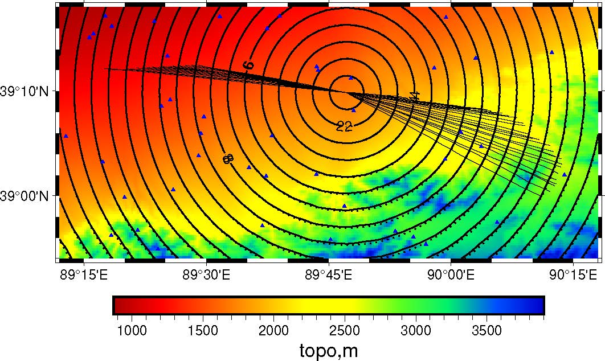

# SPM2D Manual
## 1. set topography
set your topography in `topo.dat`
``` shell
nlon nlat 
lonmin lonmax latmin latmax
... (your topography here, in m)
...
```
Where your topography will be started from (lonmin,latmin)  to (lonmax,latmax) and are sorted like:
```python
for i in range(nlat):
    for j in range(nlon):
        f.write("%f\n",z(i,j))
```

## 2. set study area and inverse problem parameters
Set all parameters in  `spmst.in`

## 3. Set dispersion data
In `surfdata.txt`, repeat the snippet:
```
# evlo evla nsta
stlo stla v0 (nsta lines )
```

## 3. run the code
change `EIGEN_INC` in `Makefile`, and use 
```bash
make -j
```
to compile the code. Then go to `example` and use `../bin/tomo` to run it.

## 4 plotting


