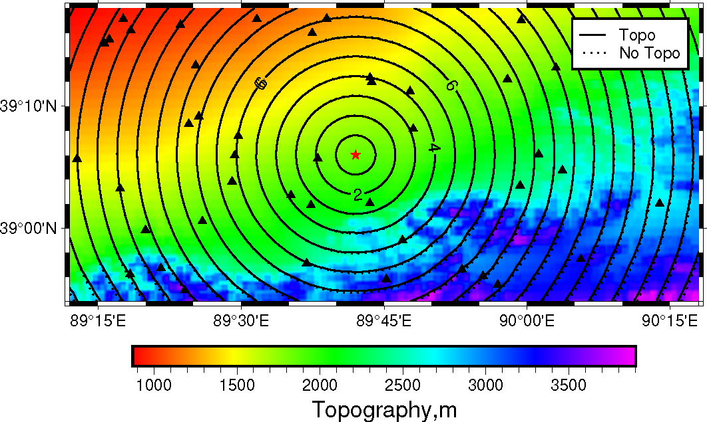

# SPMST: Surface Wave Tomography with Topography
## Introduction 
SPMST is a package to conduct 2-D surface wave tomography with topography by using shortest path method. In this method, surface wave is viewed propagated along the (curved) surface. 

The package currently support both spherical and cartesian coordinates to adapt surface wave tomography at different scales. The option could be set in the input file `spmst.in`. Some examples are included in the directory `EXAMPLES`.

## USAGE:
### 1. Set your Topography File
set your topography in `topo.dat`
``` shell
nlon nlat 
lonmin lonmax latmin latmax
... (your topography here, in m)
...
```
Where your topography will be started from (lonmin,latmin)  to (lonmax,latmax) and is sorted like:
```python
for i in range(nlat):
    for j in range(nlon):
        f.write("%f\n",z[i,j])
```

### 2. Set Study Area and Inverse Problem Parameters
Set all parameters in  `spmst.in`. It is a self-explained file.

### 3. Set dispersion data
In `surfdata.txt`, repeat the snippet:
```
# evlo evla nsta
stlo stla v0 (nsta lines )
```
### 4. Set Your Initial and True Model
The initial model and the True model are in the same format. It's just a single column (please see `velocinit.in`). The file will be started from (lonmin,latmin)  to (lonmax,latmax) and is sorted like
```python
for i in range(ny):
    for j in range(nx):
        f.write("%f\n",veloc[i,j])
``` 
Where `nlat (ny)` and `nlon (nx)` should be the same with that in `spmst.in`.

### 5. Compile and Run the Code
Change `EIGEN_INC` (path to the [Eigen](https://eigen.tuxfamily.org/index.php?title=Main_Page) libary) in `Makefile` and use 
```bash
make -j4
```
to compile the package. After that two binaries will be in the `bin` directory: `tomo` and `travel`. The `tomo` is to conduct 2-D tomography and the `travel` is to synthetic the whole time field for a specific event. Just feel free to go to `EXAMPLES` to run all the examples here.

## Gallery
### Travel time Field with Topography


### Checkerboard Recovered


### An Image in Sichuan Basin (T=6s)
