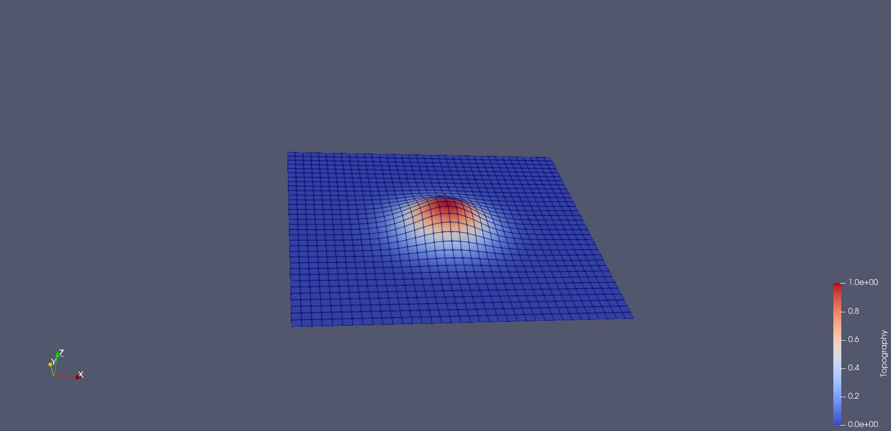

# SPMST: Surface Wave Tomography with Topography

# Manual
see [doc](doc/UserManual.md)

## Gallery
### Topography Adaptive Mesh

### Travel time Field with Topography

### Checkerboard Recovered

### An Image in Sichuan Basin (T=6s)
